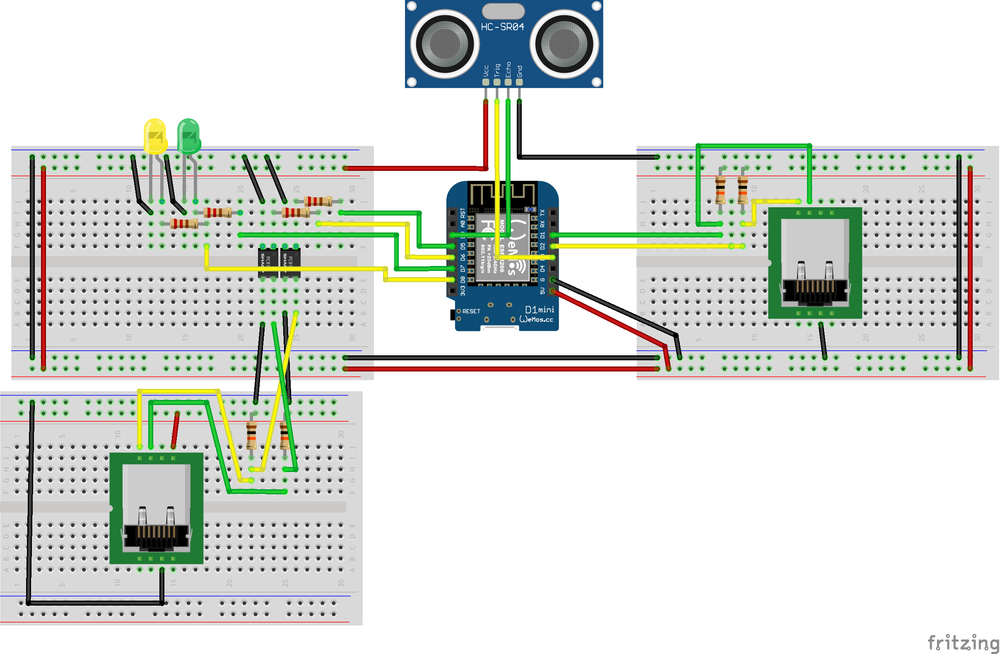
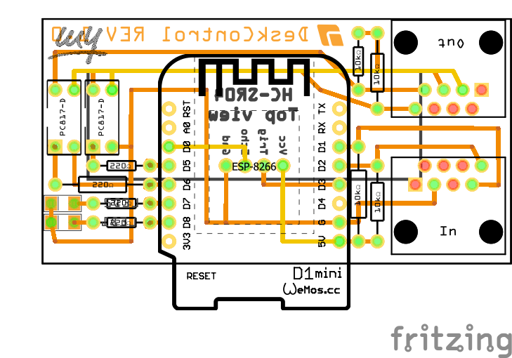

# myDeskControl Steuerung
## Wofür ist myDeskControl?
myDeskControl ist eine Arduino basierte Erweiterung für Assmann Sympas Steh-Sitz-Tische. Sie wird zwischen die Steuerknöpfe am Tisch und die Steuereinheit unter dem Tisch geschaltet und kann so die Steuerung des Motors automatisieren. Durch Nutzung eines Ultraschalldistanzsensors können so eine Position für Oben und Unten gespeichert und angesteuert werden. 
## Wie wird myDeskControl benutzt?
An die myDeskControl Einheit wird das bestehende Anschlusskabel der Steuerungsknöpfe angeschlossen um auf Tastendrücke reagieren zu können. Die Tastendrücke werden dann verarbeitet und über ein an die bestehende Buchse der Steuereinheit des Motors angeschlossenes Netzwerkkabels die notwendigen Aktionen ausgeführt.
Dabei können folgende Funktionen über die Tasten angesteuert werden:
- Langer Druck auf :heavy_plus_sign: / :heavy_minus_sign: : Tisch auf- / abfahren (entspricht der Standardfunktion)
- Druck auf :heavy_plus_sign: direkt gefolgt von einem Druck auf :heavy_minus_sign: : Aktuelle Position als "Oben" Position speichern
- Druck auf :heavy_minus_sign: direkt gefolgt von einem Druck auf :heavy_plus_sign: : Aktuelle Position als "Unten" Position speichern
- Kurzer Druck auf :heavy_plus_sign: / :heavy_minus_sign: : Tisch automatisch zu gespeicherter Position auf- / abfahren
- Durch den Druck auf eine der Tasten während der automatischen Fahrt kann die Fahrt gestoppt oder eine automatische Fahrt in die andere Richtung ausgelöst werden.  
## Wie funktioniert myDeskControl?
myDeskControl verwendet als zentrales Bauteil einen Arduino (kompatiblen) Mikroprozessor. 
Da die Steuertasten des Tisches über ein RJ45 Kabel an der Tischsteuerung angeschlossen sind, kann der Anschluss zur Erkennung am Mikroprozessor relativ einfach erfolgen. 
Zur Positionsmessung ist ein Ultraschallsensor am Mikroprozessor angeschlossen, der bei Bedarf die aktuelle Entfernung zum Boden misst.  
Aus Tastendruck und aktueller Position kann der Prozessor berechnen, welche Aktion zum Erreichen der gewünschten Funktionalität notwendig ist. Diese Aktion wird durch eine Simulation des Tastendrucks ausgeführt.
Die Tastendrücke zum Hoch-/Runterfahren des Tisches werden durch je einen Optokoppler der das Signal dann wieder über ein RJ45 Kabel an die Steuereinheit überträgt simuliert.
Durch Betätigen beider Tasten gleichzeitig kann die aktuelle Position als Oben-/Unten-Position persistent im EEPROM des Mikroprozessors gespeichert werden und steht so auch noch zur Verfügung nachdem die myDeskControl vom Strom getrennt wurde.  
Eine maximale Fahrzeit in eine Richtung dient als Sicherungsfunktion um nicht unter Umständen (z.B. bei Defekt eines der Tasten) unkontrolliert in eine Richtung zu fahren. Alle weiteren von Werk integrierten Sicherungsfunktionen des Tisches (Maximalhöhe / Blockierungsschutz) bleiben erhalten.
## Wie kann ich mir mein eigenes myDeskControl bauen?
Für den Bau des myDeskControl werden benötigt:
- 1x [Wemos D1 Mini ESP8266-12F Mikroprozessor](https://amzn.to/37IjiAW)
- 1x [HC-SR04 Ultraschall Sensor](https://amzn.to/37GAg2z)
- 2x [RJ45 Buchse](https://amzn.to/2udEeCb)
- 2x [PC817 Optokoppler](https://amzn.to/2HF5MmR)
- 4x 220&#8486; Widerstand
- 4x 10k&#8486; Widerstand
- 2x LEDs
- 1x passende Lochrasterplatine oder alternativ die von aisler.com produzierte Platine aus dem Fritzing Entwurf.

Aus Platz- und Kostengründen wird für das veröffentlichte Projekt auf einen Wemos D1 Mini ESP8266 Mikroprozessor zurückgegriffen. Die Funktionalität kann aber für jeden Arduino-kompatiblen Mikroprozessor angepasst werden.

Auf die beiden LEDs sowie zwei der zugehörigen 220&#8486; Vorwiderstände kann verzichtet werden. Sie dienen lediglich der optischen Anzeige der aktuell betätigten Fahrtrichtung. Zusätzlich wird das Speichern der Position als Blinken angezeigt.

Der Anschluss erfolgt gemäß dem [Fritzing Entwurfs](DeskControlDeluxe.fzz) als Prototyp

oder auf der Leiterplatte

